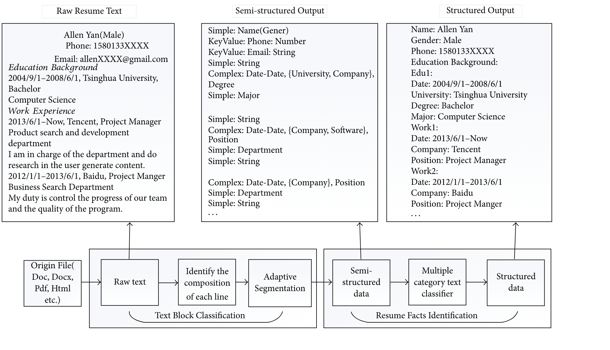

# NLP: Resume Extraction

To develop and implement an automated resume processing system utilizing Named Entity Recognition (NER) models in Natural Language Processing (NLP) to accurately extract and classify key sections such as personal details, education, work experience,
and skills from resumes. This system aims to streamline the HR resume screening process, significantly reducing the time and labor required while enhancing efficiency and accuracy.

# Problem Statement

Resumes contain surfeit information that is not relevant for the HR/authority, and they have to manually process the resumes to shortlist the promising candidates for them. And, thus making the shortlisting task a herculean task for HR. By making use of the NER(Named Entity Recognition) model of NLP this problem can be solved by finding and classifying 
the entities that are present in each resume into predefined classes such as person name, college name, academics information, relevant experiences, skill set, etc.

# Task

Problem Understanding
Data Annotation
Named Entity Recognition(NER)
Model Building & Training
Performance Evaluation & Reporting
Model Deployment
Model Inference
 

# Dataset Attributes

{

'content' : resume content or free text

'label' : Annotated Tagged Entities

 }
